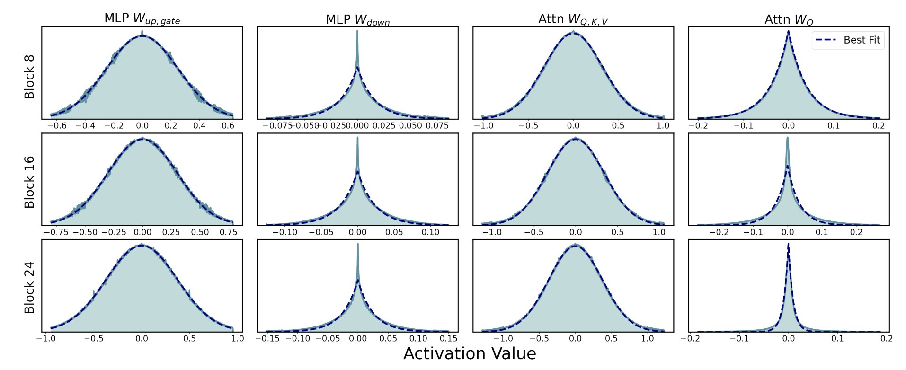
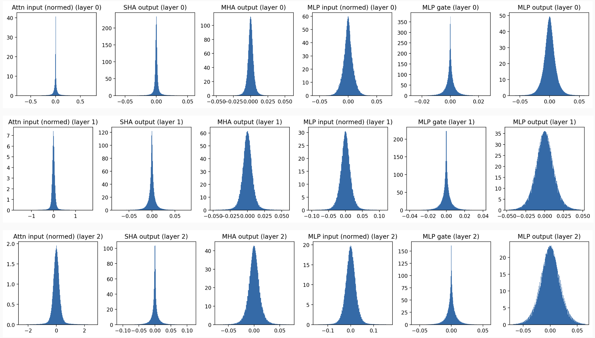
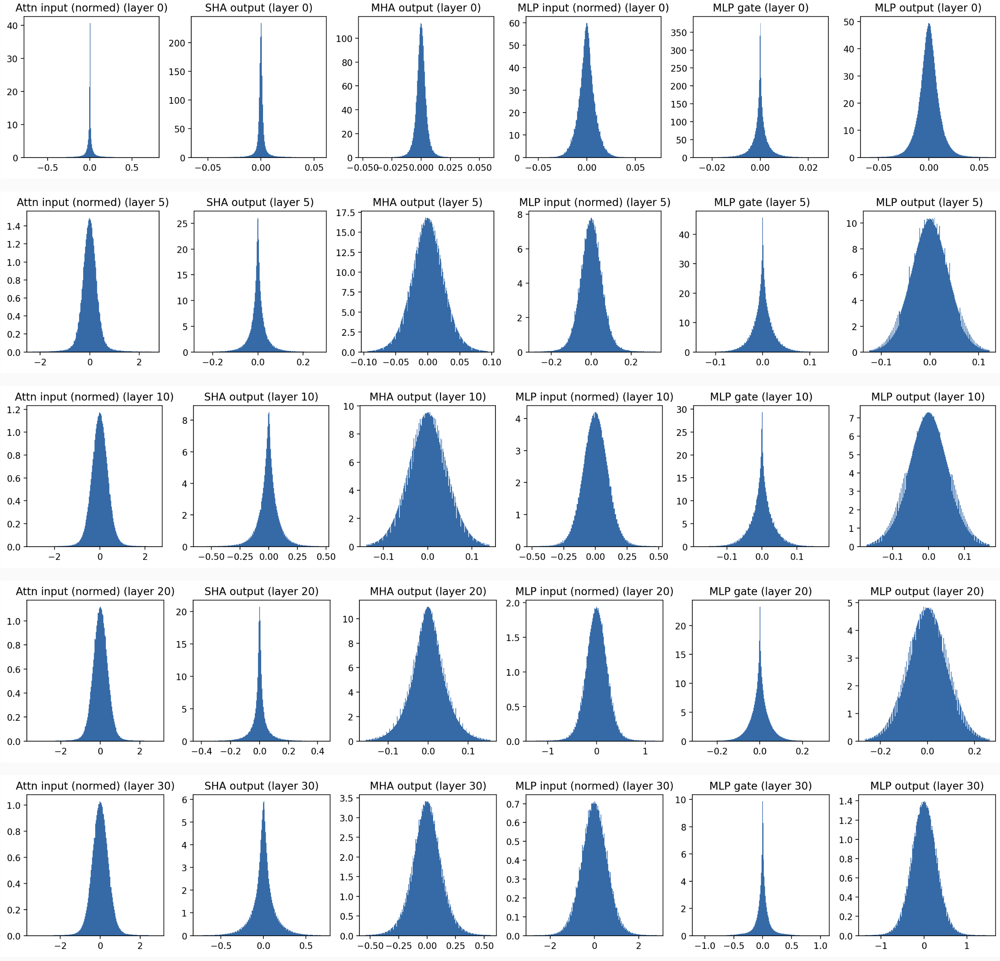
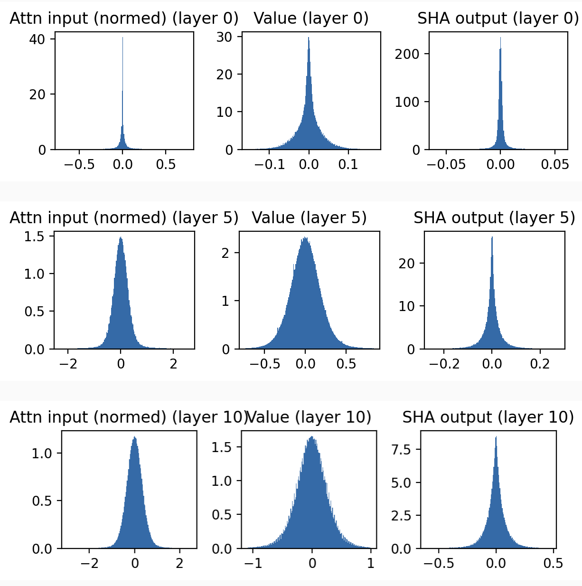
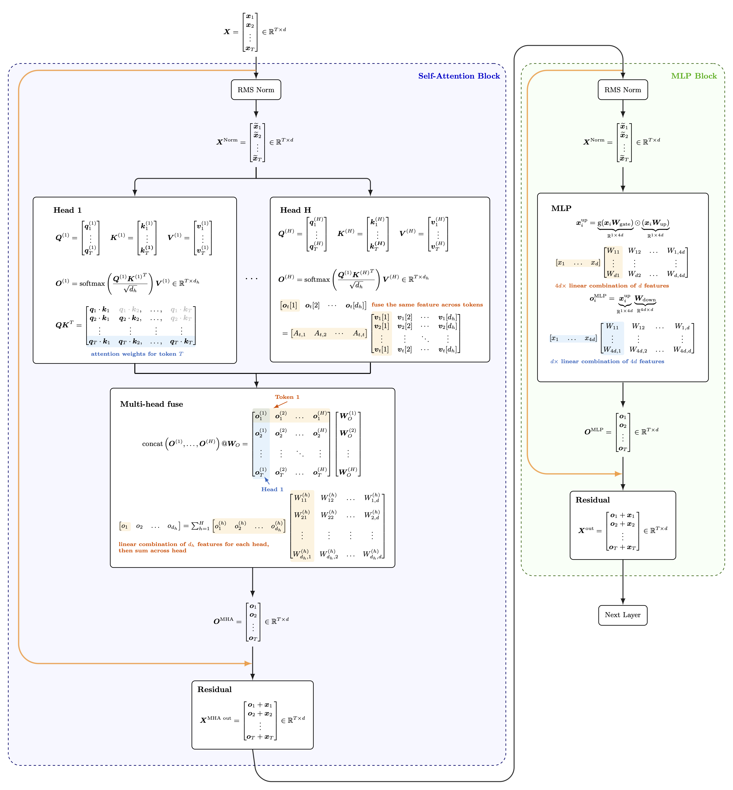

# Laplace and Gaussian distribution in LLMs
I fell down a bit of a rabbit hole while reading a paper on KV cache compression. In passing, the authors mentioned that **"[this paper](https://arxiv.org/abs/2408.14690) shows hidden states in modern LLMs loosely follow a Gaussian distribution $\boldsymbol{h} \sim \mathcal{N}(\boldsymbol{\mu}, \boldsymbol{\Sigma})$."**  (Spoiler: I think they’re drawing the wrong conclusion from what the paper actually says.)

I was half-intrigued, half-suspicious. So I checked the paper, and they have this plot:

<p align="center">
  
  <br>
  <em>Illustration from the TEAL paper showing input distributions.</em>
</p>

At first glance, this felt like magic. I wasn't entirely sure what was being plotted or if it would hold up in a different setup. So, I decided to verify it myself using Llama 3, which is the model used in the paper.

Surprisingly, I got very similar plots. The Gaussian-like and Laplace-like shapes are definitely there.

<p align="center">
  
  <br>
  <em>Activation distributions in the early layers (0-3).</em>
</p>

<p align="center">
  
  <br>
  <em>Activation distributions spanning from Layer 0 to Layer 30.</em>
</p>

To make things clearer, here’s the pseudo-code for the computation path inside one LLM layer.

```python
# Pseudo-code for the variable definitions
attn_input = norm(attn_residual)
sha_out    = SHA(attn_input)       # Sequence Head Attention output
mha_out    = sha_out @ W_o
mlp_residual = mha_out + attn_residual

mlp_input  = norm(mlp_residual)
mlp_gate   = gate(mlp_input @ W_gate) * (mlp_input @ W_up)
mlp_out    = mlp_gate @ W_down
layer_output = mlp_out + mlp_residual
```

And here is the mapping:
* **Paper:** MLP $W_{up, gate}$ $\rightarrow$ **My Plot:** `mlp_input`
* **Paper:** MLP $W_{down}$ $\rightarrow$ **My Plot:** `mlp_gate`
* **Paper:** Attn $W_{Q, K, V}$ $\rightarrow$ **My Plot:** `attn_input` 
* **Paper:** Attn $W_O$ $\rightarrow$ **My Plot:** `sha_out` 

And this is how I plot things: 
I flattened each [B, T, d] tensor and clipped it to the 99.8% quantile (otherwise, extreme outliers make the plot look like a single thin line). 
This removes the long tails just for the visualization, allowing us to actually see the distribution shape. 
So the code for plotting is

```python
def plot_hist_ax(ax, input_tensor, title_name):
    # Flatten to get all values across batch, time, and dimension
    x = input_tensor.flatten().float().detach().cpu().numpy()

    # Clip to 0.2% - 99.8% range to filter extreme outliers for better visualization
    low, high = np.quantile(x, [0.002, 0.998])
    x_clipped = x[(x >= low) & (x <= high)]
    
    ax.set_title(title_name)
    _, _, _ = ax.hist(x_clipped, density=True, bins=200)
```

So basically, if we plot the distribution of each single feature, the pattern is quite consistent:
1.  **Laplace-like (Spiky):**
    This happens after the **Single Head Attention (SHA)** and the **MLP gating** parts. The distributions are extremely peaked around zero with heavy tails. 

2.  **Gaussian-like (Bell Curve):**
    This happens after the **Multi-Head Attention (MHA)** aggregation and the **MLP Down projection**. 


# Why is this the case?

> Disclaimer: No idea if my understanding actually makes sense, so take it with a grain of salt.

Since we are looking at the distribution of features, let's really look at things on a single feature dimension.

## Single-head attention

For token $t$, denote it as 
$$
\boldsymbol{x}_t = [x_{t,1}, x_{t, 2}, \ldots, x_{t, d}] \in \mathbb{R}^{1 \times d}
$$ 

Its value at head $h$ is then 
$$
\boldsymbol{v}^h_t = \boldsymbol{x}_t \boldsymbol{W}_V^h=[v^h_{t,1}, v^h_{t, 2}, \ldots, v^h_{t, d_h}] \in \mathbb{R}^{1 \times d_h}
$$ 
where 
$$
v^h_{t,i} = \text{linear combination of } (x_{t,1}, x_{t, 2}, \ldots, x_{t, d})
$$

So basically each feature dimension of value $v^h_{t,i}$ is formed by a weighted sum of $d$ variables. Roughly speaking, we can use the **Central Limit Theorem** here. 
Since we are mixing a massive number of input dimensions (4096 in Llama 3 8B), the resulting distribution of $v^h_{t,i}$ tends to converge towards a Gaussian.

This is showing in the shift from `Attn input` to `Value` in the plot below. 

The output of token $t$ is 
$$
\boldsymbol{o}^h_t=\begin{bmatrix}
o^h_{t, 1} & o^h_{t, 2} & \ldots & o^h_{t, d_h}
\end{bmatrix} = 
\begin{bmatrix}
A^h_{t, 1} & A^h_{t, 2} & \ldots & A^h_{t, t}
\end{bmatrix} 
\begin{bmatrix}
v^h_{1,1} &  v^h_{1, 2} & \ldots & v^h_{1, d_h} \\[1em]
v^h_{2,1} &  v^h_{2, 2} & \ldots & v^h_{2, d_h} \\[1em]
\vdots & \vdots & \vdots & \vdots \\[1em]
v^h_{t,1} &  v^h_{t, 2} & \ldots & v^h_{t, d_h} \\[1em]
\end{bmatrix}
$$
where
$$
o^h_{t, i} = \text{linear combination of } (v^h_{1,i}, v^h_{2,i}, \ldots, v^h_{t,i})
$$

So we are doing weighted sum again, the difference is attention weights $\boldsymbol{A}$ is much more sparse than the value projection matrix $\boldsymbol{W}_V$.
Instead of mix features, this is more like a feature selection step:
1.  The Spike (at 0): For most tokens, the attention weight is near zero, or the feature isn't active, leading to the massive spike in the middle.
2.  The Tails: When it *does* activate, it grabs a specific, strong signal, creating the heavy tails.


<p align="center">
  
  <br>
  <em>Figure: Comparison of Value vectors (left) vs SHA output (right).</em>
</p>

## Multi-head attention fusion
The output for token $t$ is
$$
\boldsymbol{o}_t
=
\sum_{h=1}^{H}
\begin{bmatrix}
o^{(h)}_{t,1} &
o^{(h)}_{t,2} &
\ldots &
o^{(h)}_{t,d_h}
\end{bmatrix}
\begin{bmatrix}
W^{(h)}_{1,1} & W^{(h)}_{1,2} & \ldots & W^{(h)}_{1,d} \\[0.4em]
W^{(h)}_{2,1} & W^{(h)}_{2,2} & \ldots & W^{(h)}_{2,d} \\[0.4em]
\vdots          & \vdots          & \ddots & \vdots           \\[0.4em]
W^{(h)}_{d_h,1} & W^{(h)}_{d_h,2} & \ldots & W^{(h)}_{d_h,d}
\end{bmatrix}.
$$

So we have
$$
o_{t, i} = \text{sum of} \Big(\text{linear combination of } (o_{t, 1}^{(h)}, o_{t, 2}^{(h)}, \ldots, o_{t, d_h}^{(h)})  \Big)
$$

Each output dimension is different linear combination of the same $(o_{t, 1}^{(h)}, o_{t, 2}^{(h)}, \ldots, o_{t, d_h}^{(h)})$ across different head. 

The output projection matrix is dense again, so we end up with Gaussian shape.


<p align="center">
  
  <br>
  <em>Computation path within a layer.</em>
</p>
